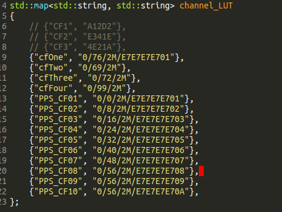

# Installation

## For Student and Teacher

### Install Script
Installation with the install script is the easiest. You will need:
- the install script
- the ``d_fall_pps`` package compressed in a file called ``package.tar.gz``
- the rule files for the USB connection to the crazyradio, called ``99-crazyflie.rules`` and ``99-crazyradio.rules``

These files all need to be in the same directory. To run the installation, move to the containing directory (pps\ install) and call it with
```
./pps_install.sh <student id>
```
The student id needs to be a unique number that is used as identication for the student laptops connected to the teacher. Make sure not that the script file is marked executable and to not run the script as root, as it will ask for the password and only execute some commands with root privilege.

### Manual Installation
The installation process consists of the following steps:

- Installation of ROS: <br />
The detailed instructions for the installation of ROS can be found [here](http://wiki.ros.org/kinetic/Installation/Ubuntu).

- Workspace: <br />
Create a new catkin workspace and copy the ``d_fall_pps`` package into the ``src`` folder of the workspace. Then build the package with ``catkin_make`` called from the workspace root.

- Environment Setup: <br />
Add a new line in the ``/etc/hosts`` file that links the teacher's IP with the domain name ``teacher`` and create a file called ``/etc/StudentID`` that contains the student id. Only write digits without any other symbols or whitespace characters.

- USB Crazyradio: <br />
To set up the crazyradio USB dongle just copy the rule files ``99-crazyflie.rules`` and ``99-crazyradio.rules`` from directory ``pps\ install/`` to the directory ``/etc/udev/rules.d``.
You also have to install the library pyusb:

```
sudo apt-get update
```

```
sudo apt-get install python-pip
```

```
sudo pip install pyusb
```

- Source scripts in ``.bashrc``: <br />
Add following lines to the bottom of the file ``~/.bashrc`` (replace ``<catkin workspace>`` with correct directory)
```
source /opt/ros/kinetic/setup.bash
source <catkin workspace>/devel/setup.bash
source <catkin workspace>/src/d_fall_pps/launch/Config.sh
```

The workspace setup script will only appear after the first compilation of the catkin workspace.

If you are not sure at any point you can check out the install script.

### Vicon Datastream SDK Installation

A Vicon motion capture system can be used to provide position and attitude measurements of the Crazyflie and close the feedback loop. The software provided by Vicon is propriety and hence is not included in this piece of Open Source software. In order to make the position and attitude data accessible over the network, the piece of software called the Datastream SDK needs to be downloaded and placed in the correct folder. Complete the following steps to achieve this:

- Download the Vicon Datastream SDK from [https://www.vicon.com/products/software/datastream-sdk](https://www.vicon.com/products/software/datastream-sdk) (or if this link is broken for some reason you can search for the Datastream SDK download directly via the Vicon website)
- This set of instructions was tested with version 1.7.1 of the Datastream SDK
- De-compress the downloaded file and open the folder that corresponds to the latest ``Linux64-boost-1.xx.x`` version, when tested this was ``1.58.0``
- From the files found in this folder, copy the file ``DataStreamClient.h`` into the following folder:
```
~/pps_ws/src/d_fall_pps/include/
```
- Copy the file ``libViconDataStreamSDK_CPP.so`` into the following folder (noting that the folder ``lib`` and ``vicon`` may need to be created):
```
~/pps_ws/src/d_fall_pps/lib/vicon/
```
- Copy all the files of the form ``libboost_*`` into the same ``/lib/vicon/`` folder
- Note that the ``DataStreamClient.h`` header file and the ``/lib/vicon/`` folder are in the ``.gitignore`` and hence will not be tracked or removed by the git repository (though some more advanced git commands may still remove them anyway).


## Additional Steps for Teacher

### Removing Config.sh and replacing
As the teacher must not source the script ``Config.sh``, the ``.bashrc`` must be edited and the last line
```
source ~/pps_ws/src/d_fall_pps/launch/Config.sh
```
must be replaced with
```
export ROS_HOSTNAME=teacher
```

### IP-Addresses
Currently the teacher's IP is ``10.42.0.10`` and the student's IP are of the format ``10.42.0.xx``, where xx is an unused address.

### Installation of cfclient
The steps to install the crazyflie client are taken from [here](https://github.com/bitcraze/crazyflie-clients-python). To install the cfclient you need to install its dependencies:
```
sudo apt-get install python3 python3-pip python3-pyqt5
```
clone the git repository, change the directory to the root directory of the repository and execute
```
pip3 install -e .
```

## Steps for adding a Crazyflie to the system

When we build a new crazyflie, it must be added to the system. The steps for
doing so are these:

1. Find out the radio address of the crazyflie that you want to fly
   (`radio://0/79/2M`, for example). You can change this address using the
   cfclient (Connect->Configure 2.0, write parameters and then reset the CF for
   changes to take effect) <br><br>
2. After having put some reflective markers in the crazyflie, register it in the Vicon system with the name that you want. (in the PPS case, we call them PPS_CFXX)<br><br>
3. Go to the file channelLUT.cpp (path:
   `pps_ws/src/d_fall_pps/GUI_Qt/CrazyFlyGUI/src/channelLUT.cpp`) and add an
   entry with the name of the crazyflie and the radio address. Follow the
   formatting that the other entries have.<br><br>
    <br><br>
4. Go to pps\_ws folder, and in a terminal write `catkin_make`<br><br>
5. Run the teacher's GUI, and if you registered correctly your crazyflie with the proper name in Vicon (and enabled it by ticking it in Vicon PC), in the crazyflies dropdown box, after pressing "refresh crazyflies" button you should be able to see the name you assigned.<br><br>
6. When you select it, you should see in the field "Radio address" in the radio address that you assigned to that name in channelLUT.cpp<br><br>
7. Link it to a CFZone previously created and to the student ID of your computer and, once everything is in the linked table,  click Save in DB<br><br>
8. Open the student's GUI in student computer, and you should be able to connect to your crazyflie, if every step above was done successfully.<br><br>
