# Setup

## Vicon
### What is Vicon
Vicon is the tracking system for this project. The four cameras in each corner of the room can track the gray markers. One can define objects in the ViconTracker software. Those are then visible in the software or their location data can be shared over a network with others.

### Our Vicon Setup
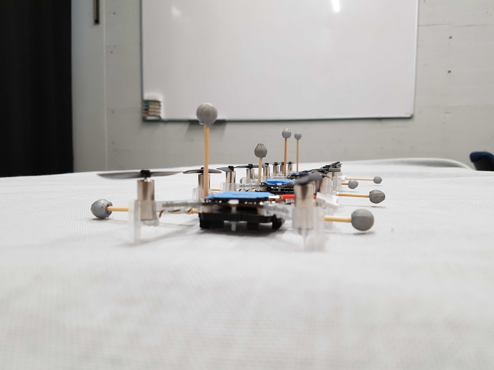
For the PPS we have a separate computer that runs the ViconTracker software. There we define the crazyflie objects that need three markers in slightly different layouts to be distinguishable from another. (see right side)

ViconTracker sends ViconData over the network to the teacher's computer. The teacher computer distributes the data to the students.

### Instructions
#### Calibrating Vicon
1. For calibrating Vicon go to *CALIBRATE* where you should choose *Camera-PixelView* as the *view type*.
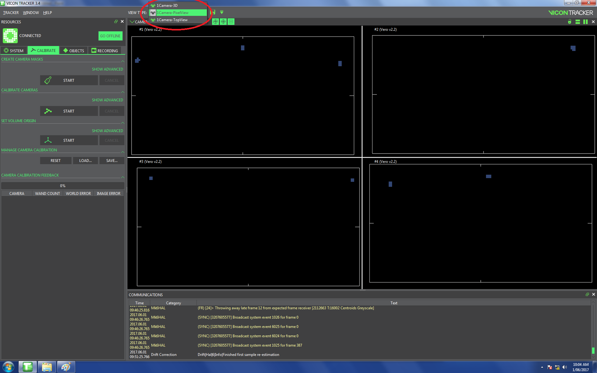   

2. Click on *START* in the *Calibrate Cameras* section. Now you have to walk around the room with the L-wand and swing it in every direction. You can stop when the program is finished.
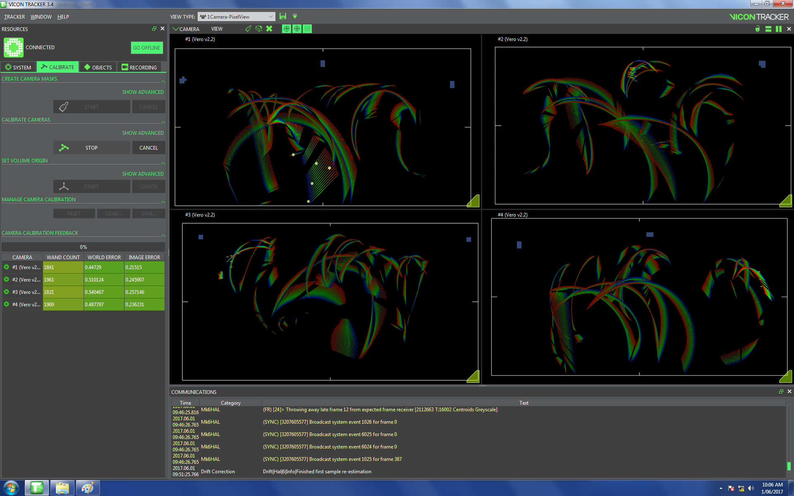   

3. Then you have to lay the wand down somewhere in the room, where you want the origin of the coordinate system to be. How the wand defines the x- and y-axis is shown below. (The handle defines the y-axis, where positive is in direction of orange part. The x-axis is positive in the direction of the longer arm) 
Click on *SET ORIGIN* and you're set. 
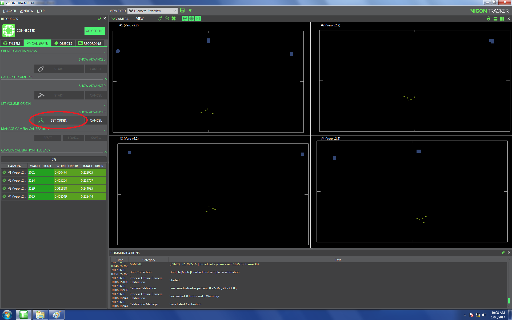 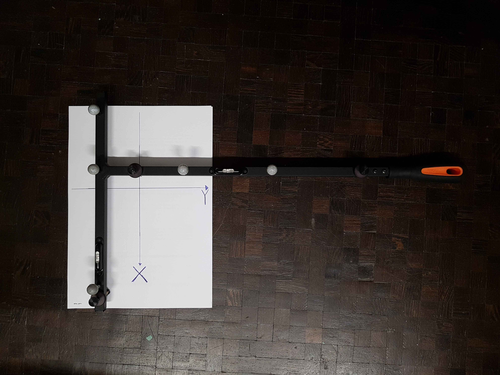   

#### Defining a CrazyFlie in ViconTracker
1. Go to *OBJECTS* and choose *Camera-3D* as the *view type*   There you should see some markers.
 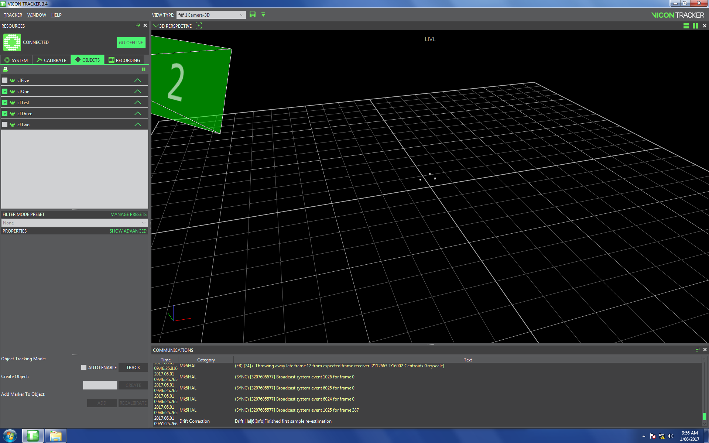   

2. Make sure that the crazyflie antenna is facing in the positive x-axis when you define the crazyflie, because the controller relies on this configuration.
  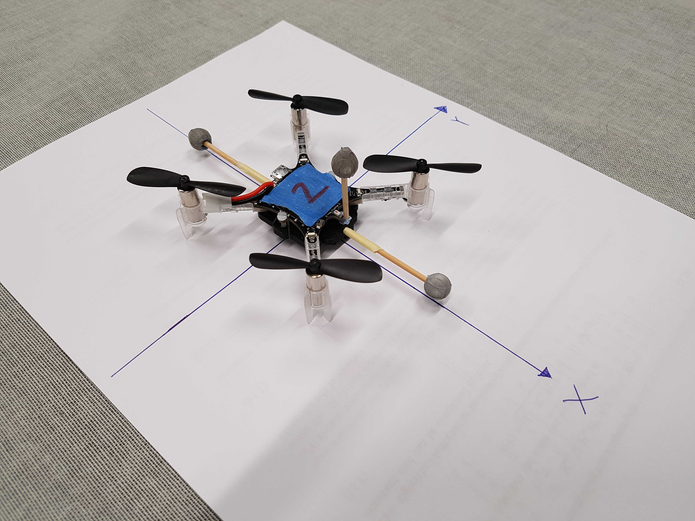   

3. Define an object by `ctrl-rightclick` on the markers and name it in the down left corner. Finish by clicking *CREATE* and saving with `ctrl-s`. Vicon doesn't share the object's data if you don't save.  
 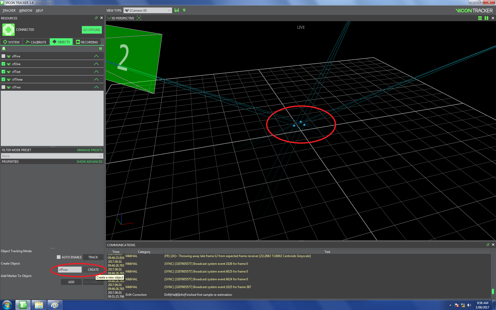    

4. That's how it looks afterwards  
 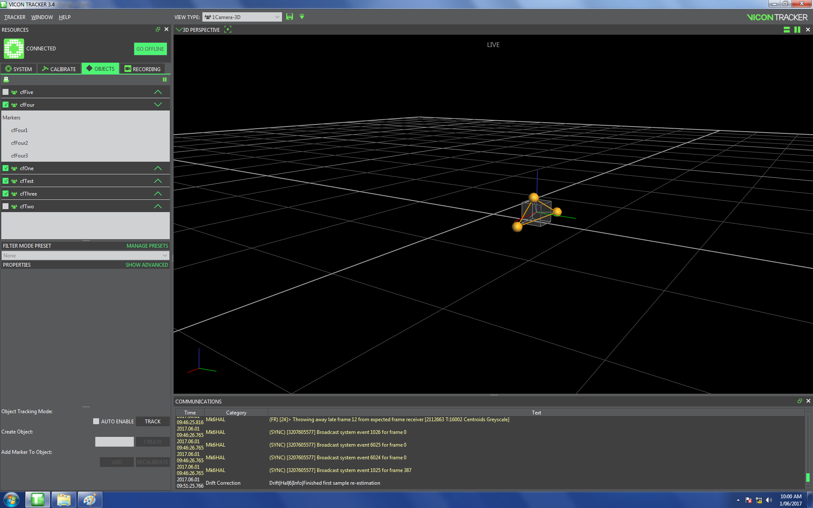   

## Network
### Setting up the Vicon network
Inseret the Ethernet cable from Vicon into your computer and go to network settings in the top right corner. Click on _Edit Connections..._  
Choose the Ethernet connection (probably named _wired connection 1_) and click on _edit_.
 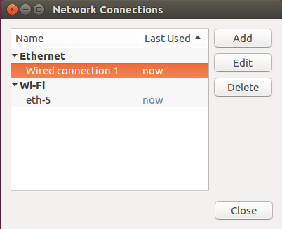  
Change the connection name to _Vicon_.
 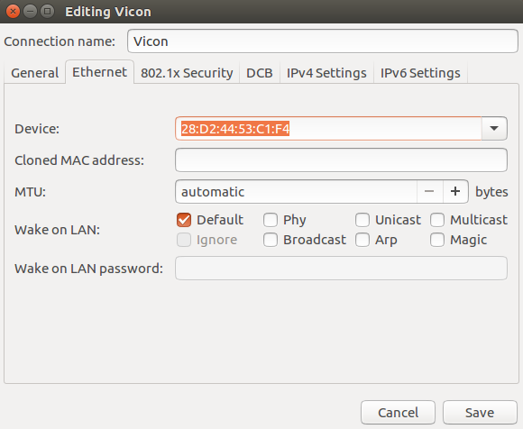  
Then go to the _IPv4 Settings_ and choose **Manual** as the _Method_ and then add your IP address provided by your teacher (Form 10.42.0.xx). Click tab twice and _save_.
 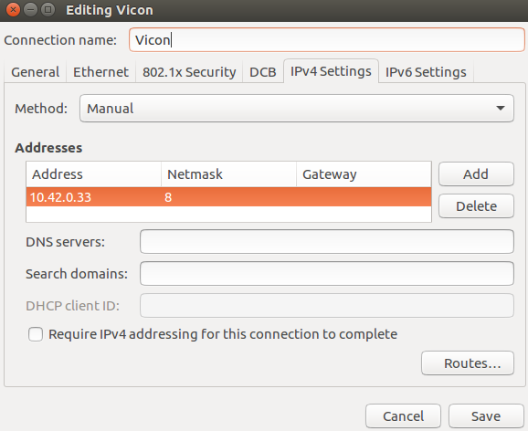  
**Don't forget to choose the Vicon network manually if you choose to enable WiFi and Ethernet simultaneously as described below!**

 
### Vicon, teacher and students
During installation process is the IP address of the teacher set to 10.42.0.32. (This value is written to the /etc/hosts file such that this IP address is accessible through the keyword _teacher_)  
Have a look at `Config.sh` in `~/pps_ws/src/d_fall_pps/launch/`
 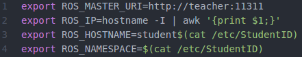  
Here you see, that the ROS Master URI is set to be the teacher. This means that _roscore_ runs only on the teacher's computer. Your own IP address (_ROS IP_) is also set and taken from your Ethernet settings as defined in the section _Setting up the Vicon network_.
 
### Using WLAN and Vicon simultaneously
Without some adjustments it is not possible to use an Ethernet and a wireless network at the same time. Vicon is connected via cable and therefore wouldn't allow a connection to the Internet. Because it's tedious to always unplug the cable just to be able to look something up on Google, we provide an explanation on how to enable simultaneous usage of WLAN and Vicon.  
**But careful: If you enable this setting you have to choose the Vicon network manually. This is a common mistake! You will get an error if the cable is inserted but not manually chosen as shown in the picture below.**
 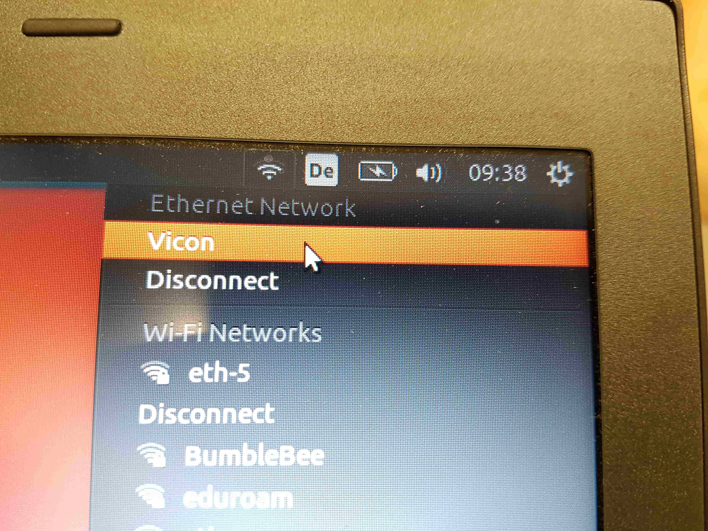  
#### Step by Step:
Ubuntu allows multiple connections by default, but sometimes, we need to specify which one to use. In your comments, you have mentioned that you use LAN for the Intranet and WiFi for the Internet.

So, firstly search for Network Connections in the unity dash. Then, under the Ethernet section, click 'Add' button.
 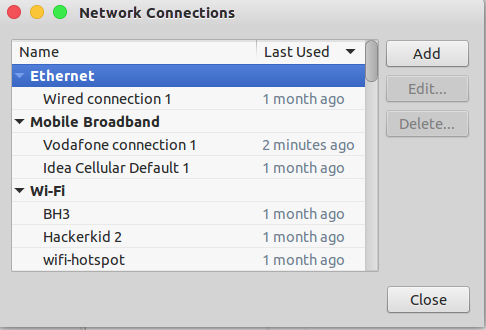  

Then, we need to create a new Ethernet connection which we are going to enable manually. Uncheck the option of connecting automatically since this is your Intranet connection. **Choose _Vicon_ as a name instead of Intranet**
 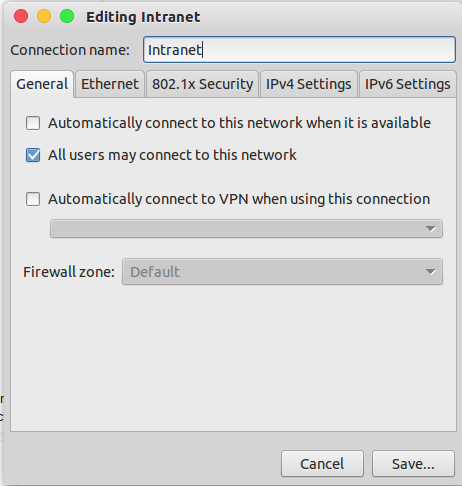  

Then go to the IPv4/IPv6 settings (depending on your network) and then click on the Routes button. Check the 'Use this connection only for resources on its network' option. Click Save.
 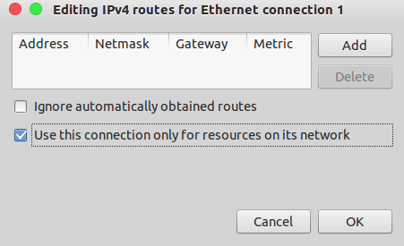  
Now you can use both the LAN and WiFi simultaneously.

 
Source:   https://askubuntu.com/questions/639100/how-to-get-connection-to-both-wifi-as-well-as-lan-in-ubuntu-14-04-lts#639425
 
Some additional informations:   http://aleksz-programming.blogspot.ch/2013/01/using-wifi-and-network-cable-at-same.html
